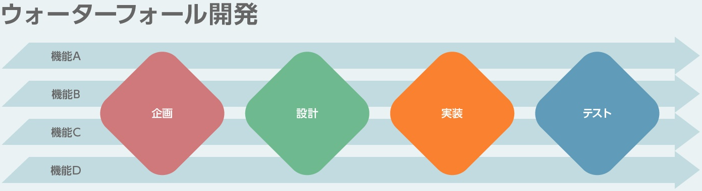
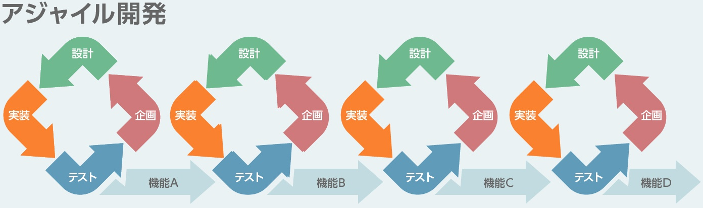
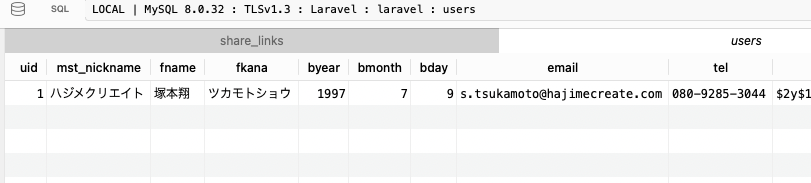

# システム開発の流れについて

---

## システム開発の手法

代表的な手法には次の二つがあります。

1. **ウォーターフォール型**
2. **アジャイル型**

---

## ウォーターフォール型とは

---

- **ウォーターフォール型**は、段階的に開発を進める方法です。
- 開発は各工程を順番に進めます。
- 基本的には一度終わった工程には戻りません。

---

- チーム全体が同じ進行状況を共有しやすいです。
- 役割分担が明確で、それぞれの担当がはっきりしています。

---

- 明確な要件と設計に基づいて進むため、変更が少ないです。
- そのため、安定したプロジェクト管理が可能です。

---

## アジャイル型とは

---

- **アジャイル開発**は、短期間の反復サイクルで開発を進める方法です。
- 変更に柔軟に対応でき、顧客の要望や市場の変化に即応できます。

---

- 短い期間で繰り返し開発し、各サイクルごとに成果物を確認します。
- これにより、プロジェクトの途中でも価値を提供できます。

---

- チームのコミュニケーションが密になりやすいです。
- 迅速な意思決定が可能です。
- 顧客や関係者と頻繁にフィードバックを交換しやすいです。

---

## ウォーターフォール型とアジャイルの違い

---

**ウォーターフォール型の特徴**：

- 各工程を順番に進めます。
- 後戻りが難しいです。

---

- 全体の計画が立てやすく、進行状況が把握しやすいです。
- 大規模かつ長期のプロジェクトに適しています。

---

**アジャイル型の特徴**：

- 短い反復サイクルを使います。
- 途中の修正が容易です。

---

- 小規模かつ変化の多いプロジェクトに向いています。
- 変更に柔軟に対応でき、顧客の要望にも応えやすいです。

---

## まとめ

---

- **ウォーターフォール型**と**アジャイル型**には、それぞれの特長と適応する案件があります。

---

- 大規模な案件にはウォーターフォール型、小規模でスピードが求められる案件にはアジャイル型が採用されることが多いです。

---

- プロジェクトの規模や内容に応じて、最適な開発手法を選択することが重要です。

---

## 開発の主なフェーズ

---

1. **要件定義**
    - 顧客のニーズや要望を詳しく理解し、プロジェクトのゴールを明確にします。

---

2. **仕様書作成**
    - 要件を具体化して文書化し、システムの詳細な仕様を定義します。

---

3. **基本設計**
    - システム全体の構造を設計し、各機能の概要を決めます。

---

4. **データベース設計**
    - データを保存するためのデータベースの構造を設計します。
    - どんなデータを、どういう形式で保存するかを決める作業です。

---

4. **データベース設計**
    - Userテーブルの例です。
    - 

---
5. **プログラミング**
    - 要件定義書や仕様書に従って、実際にプログラムを作成します。

---

6. **テスト**
    - 作成したプログラムが正しく動くか確認します。

---
6. **テスト**

- 個々の機能を確認する「単体テスト」、
- 全体がうまく連携して動くか確認する「結合テスト」があります。

---

## 開発の最終フェーズ

---

7. **デバッグ**
    - 不具合を発見し、修正することでシステムの品質を向上させます。

---

8. **リリース**
    - 完成したシステムを顧客が使えるように本番環境に設置します。